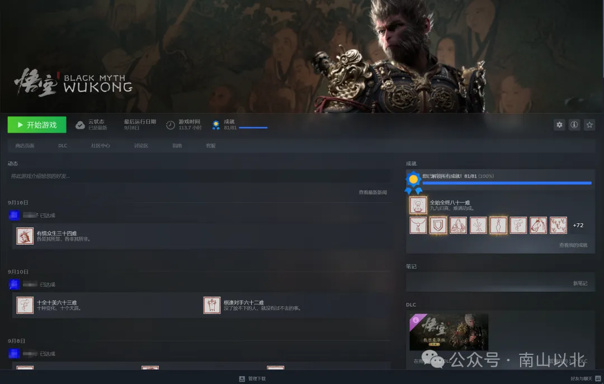
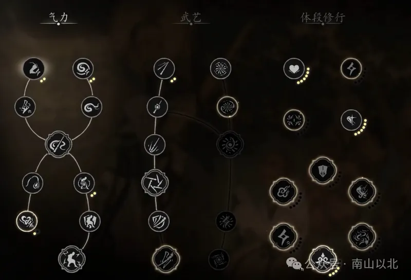

从《黑神话：悟空》的第一个预告片开始，我就对它抱有极高的期待，而最终游科交出的答卷也没有辜负这份期待。113h+，steam 81 难全成就，回看这一个月，正如黑神话的设定「重走西游路」，我完全代入进天命人这个概念中，体验了儿时所期盼的，成为大圣一路西游。

《黑神话：悟空》有着丰富的探索区域，厚实的箱庭关卡设计，每个章节之间用独特风格的动画进行衔接，而在单个章节之间会有独立的故事情节进行驱动。而在主线之外，复杂多变的隐藏支线更是为探索提供了乐趣，每一条分岔路可能都是一个隐藏的 boss，或者是一段特殊的情节，亦或是一些关键的道具。总之在游戏中，玩家需要真正去探索每一条「西游路」，沉浸式体验游科搭建的精彩的故事主线与丰富的支线内容。我也想从「路」这个概念切入，谈谈玩下来对这款游戏的理解和感受。

  

  

**0****1**

  

  

**黑神话中的路**

「重走西游路」，这个设定让游戏可以遵循原著的框架，但不局限在原著的剧情中，写出带有制作人风格的游戏剧情。游戏中的六根五蕴，肉体陨落精神传承，反抗强权，都是基于原著改编的独有的属于国人的精神养分，催化出关于斗争的真实幻梦。基于这些剧情设定，《黑神话：悟空》大量引用中国特有的文化意象，并且将它们巧妙融合进游戏的场景设计和音乐设计中。同时作为一款 ARPG，它并未跳脱这种类型游戏的核心玩法。但它不是一味模仿，而是结合特有的传统棍法构建武器和技能组合，同时支持无消耗洗点和死亡无掉落，协助玩家建立自己独特的 build（构筑）系统。另外不可忽视的是，《黑神话：悟空》看似类魂游戏，但实际游戏难度并不高，且由于引用原著中「变身」「分身」「丹药」概念，降低游戏难度和负反馈，提升了战斗容错，让非硬核游戏玩家也能快速上手。以上这些设计，让游科在国产 3A 游戏中，走出了一条属于自己的路，即在利用现有的游戏框架下，做出自己的差异化。

不过，诚然上述形而上的「路」有其重要性，但作为一款游戏，更核心的是游戏本身「是否好玩」，这一点也是游科 CEO 在采访中表达的观点。游戏在成为宣传工具之前，最重要的还是游戏游玩体验本身，即所谓游戏性。各个社区中都对黑神话的美术、部分 boss 设计、文化内容、章节动画的称赞颇多，但同时对地图引导，或者说更具体的「路」这个概念，却普遍存在批评。从我的观点来看，《黑神话：悟空》是为了美术设计，或是场景设计，让关卡设计做了「让步」，但瑕不掩瑜。下面举一些地图设计的问题例子：

  

  

01

  

游戏中很多场景虽然精美异常，但利用率却很低，表现为游戏中存在大量空旷的场景。比如 B 站有 up 主重走了一遍斯哈里国，发现在其中甚至有一个体量不小的完整地图，不过实际在游戏中只有蝜蝂一个 boss。当然玩家也能理解发售压力，势必会砍掉部分内容和存在大量废案，但至少在实际游玩过程中，这并不是一个很好的体验。

，时长03:14

另外游戏中隐藏了一些非常深的支线场景，如果不看攻略可能多周目也很难发现。「游科还在藏」这个梗到发售后第一批玩家速通后依然被人津津乐道，这也体现了场景设计的不足，缺乏有效的利用和良好的引导。  

02

  

  

游戏中岔路设计略不合理。比如第二章黄风岭，有个很有意思的梗是【宇宙中心枕石坪】。在这个上香点附近，有石先锋、石敢当、石母、黄袍员外、小骊龙等 boss 和很多小怪可以触发，这其实是游戏地图岔路设计时，更多使用节点树状设计而非鱼骨设计。另外就是在地图的岔路，缺少拥有记忆点的特征。比如第三章小西天，大片白茫茫的雪地，复杂的岔路，但缺少具有标志性的建筑或者标识，我到现在都记得为了刷鳖宝头骨这个披挂，往返上香点和怪物点多少次，每次都会忘记过去的路从哪里走。虽然游戏鼓励玩家自由探索游戏中的场景，但本质上游戏并不是所谓「开放世界」，也做不到建筑的「所见即所得」，这就让玩家到达某个节点时，面临的选择过多，不知道应该往哪条路走。

03

  

空气墙。这也是大部分测评中被诟病的设计点，它的存在会极大提升玩家探索的负反馈。当你觉得有个路线可以通过但被阻挡时，必然会出现挫败感，这种挫败感会影响到后续对游戏地图的探索，而这又恰好违背了游戏设计者对于探索路线这一主题的设计初衷。不过我在游玩过程中，因为对游戏本身有预期，且游戏地图场景设计实在精美，空气墙对我的游戏体验影响有但并不大。

  

**0****2
**游戏的路**

回顾到《黑神话：悟空》上，当我们在谈论它时，会优先给它带上「历史传承」「文化输出」的标签。在这类语境下，比起游戏，它已经更多是一种文化符号，一种中国传统文化的现代载体。就像冯骥在采访中谈到的那样，「国产」不是免死金牌，而应该是更大的责任感和使命感，这也让游科为国产 3A 游戏探索出一条路，而国外玩家的超出预期的好评和对中国传统文化的接受和包容也印证了这条路的成功。

作为国产游戏，可以预见的还有较长一条路需要走，但可以明确的是，游戏已经在网络时代成为构建文化的重要维度，其发展潜力也将越来越呈现出不可估量的价值。在全球化的今天，游戏不应该被像以前一样看作洪水猛兽，让国产游戏走向世界，也是「网络空间命运共同体」的理念中应有的一部分。从文化层面来说，全球化的商品逻辑，让文化原有的精神属性发生了变化，游戏作为全球化商品的一份子，它可以快速传播，和文化深度融合，同时易于理解，这就让游戏先天成为文化阵地的重要组成部分。看回到国产游戏，我们起步慢，规模小，既是机会，也是挑战。机会是我们可以认识到「他者」的局限性，挑战是如何利用好「自我」的独特性。

  

**0****3**

  

  

**天命人的路**

我想，《黑神话：悟空》的成功，最重要的就是源自于游戏开发者对于它的「热爱」，这个词也是是冯骥和杨奇在各自采访中多次提到过的。在游戏开发过程中，设计者投入十分的热情，极尽所能为玩家还原西游场景，给玩家最好的影音和交互体验。而在游玩的过程中，玩家也会心甘情愿去付出时间，心甘情愿承受失败，也心甘情愿去接受探索西行路上的苦与累。这种双向奔赴都是源于开发者和玩家对游戏的热爱，对传统文化的热爱，对自己心中英雄的热爱。这种热爱是真正的内驱力，让我们能各自全身心投入，享受其中的过程。

Steam 《黑神话：悟空》游戏评价里我有段很喜欢的话：「你玩不了游戏大圣也不怪你，因为大圣知道你也有你的八十一难」。在游戏里我们都是天命人，关了游戏我们都是为了生活奔波的普通人。作为天命人我们热爱黑神话，作为普通人我们要热爱我们脚下的路。借用叔叔的一句话，你所热爱的，就是你的生活。

  

  

