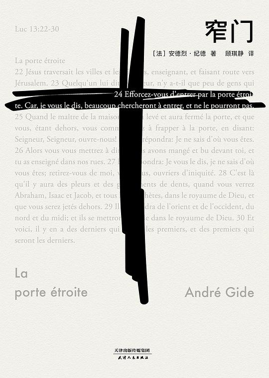
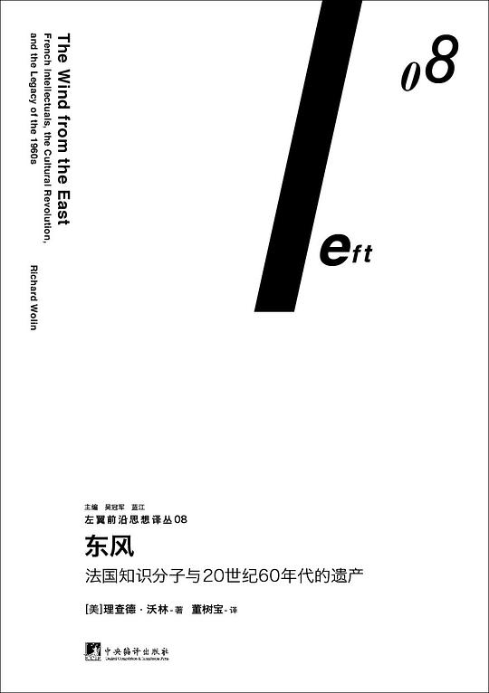
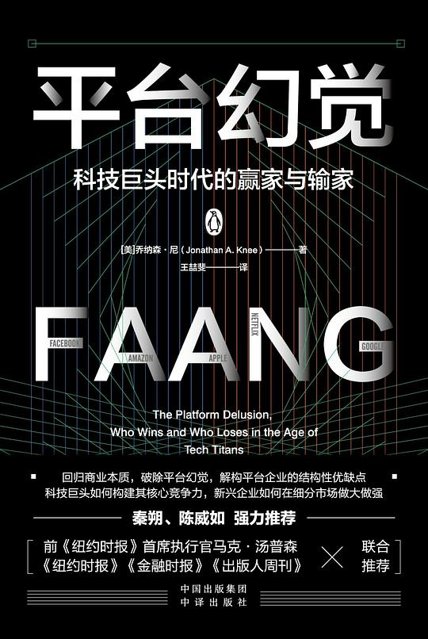
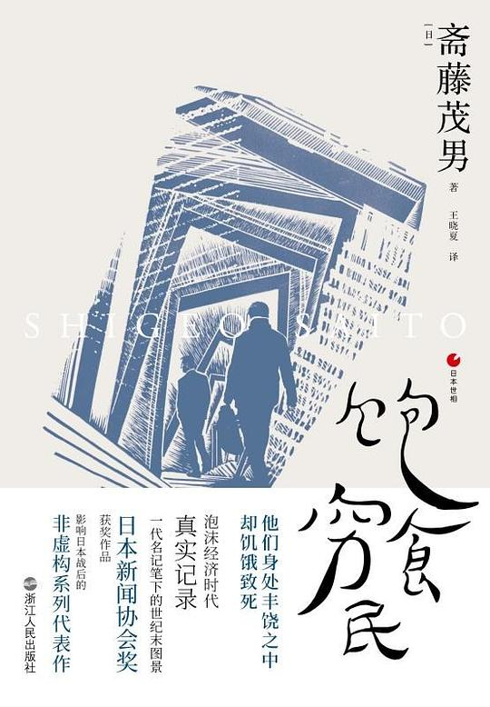
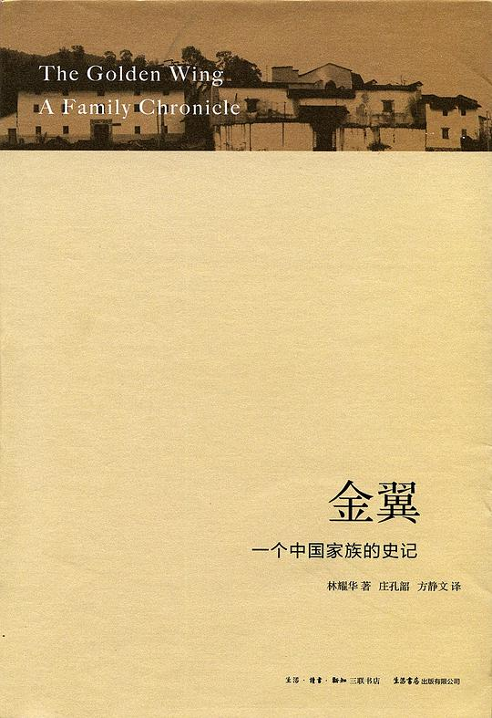
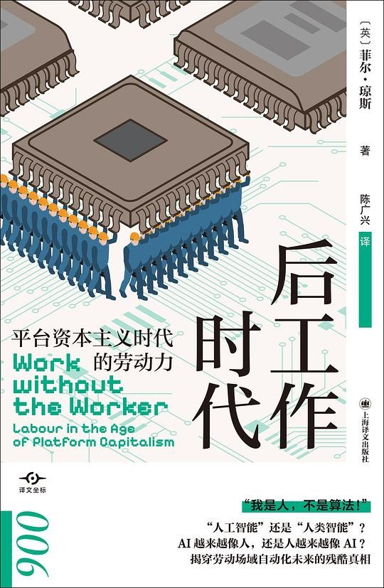

年初给自己定了个目标：读完 12 本。结果只完成了 8 本，差了不少。回头看，今年读的书整体偏厚偏重，加上工作上的事情挤占了阅读时间，进度一直跟不上。不过读书这事儿也不太该搞 KPI，少几本就少几本，读进去的比读完的重要。

和去年一样，把读过的书整理成书单，一方面是自己做个回顾，另一方面也希望遇到读过这些书的朋友，可以互相聊聊感受。

老规矩：书单很私人，评价很主观，如有不同意见，你说的对。

---

**1. 《窄门》**

读这本书是因为一个朋友反复安利了半年。说实话，翻开之前我对纪德几乎没有了解，只知道他是拿了诺贝尔文学奖的法国作家。

读完的感受是——很轻，也很重。

"轻"是说叙述本身。书很薄，情节也不复杂：一对表姐弟的爱情故事，从童年到成年，从相遇到分离。纪德的文字非常干净，没有多余的描写，像是把所有的水分都拧干了，只留下必要的东西。但恰恰是这种干净，让剩下的东西显得格外锋利。

"重"是说读完之后脑子里转的东西。阿莉莎为什么推开杰罗姆？表面上是因为信仰、因为"窄门"这个宗教隐喻——进窄门才能得永生，宽门通向灭亡。但读进去之后你发现，这不是一个关于信仰的故事，而是关于人对幸福的本能回避。阿莉莎害怕的不是杰罗姆不够好，而是幸福本身。她宁愿把自己放在一种永远在等待、永远在思念的状态里，也不愿意让这个状态结束。因为结束了，就要面对现实，现实一定不如想象完美。

这种感觉其实挺熟悉的。很多人在感情里做过类似的事——明明可以在一起，偏要找各种理由推开对方，推到"以后再说"、"等条件成熟了"、"你不懂"。这种自我设限的背后，本质上和窄门的逻辑是一样的。

这本书读完不会让人开心，但会让你想很久。

---

**2. 《东风：法国知识分子与20世纪60年代的遗产》**

读这本书的起因是对法国左翼思想的好奇。之前零零散散看过一些关于萨特、波伏娃、福柯的资料，但都只是片段，没有一个整体的图景。这本书刚好补上了这个缺口。

作者理查德·沃林聚焦在 20 世纪 60 年代的法国，那个年代的法国知识分子不是现在这样在大学里安静做学问的人，而是真正走上街头、介入政治、影响公共舆论的人物。萨特站在雷诺工厂门口读声明，福柯参加监狱调查小组，波伏娃签署请愿书——这些事情在今天看来很难想象。知识分子和公共行动在那个年代是一体的。

但这本书不是在歌颂这种介入。它同时也非常冷静地分析了这种介入的代价。六十年代的法国左翼知识分子几乎集体拥抱了毛主义，把中国文革当成一种浪漫的革命想象。等他们发现真相的时候，时间已经过去了。

有一句话记得很深：热情可以让人走得很远，但不能保证方向是对的。这句话放在任何一个年代，任何一个领域，似乎都适用。

这本书读起来不太轻松，信息量大，人名多，需要一些背景知识。但如果你想了解知识分子和政治之间的复杂关系，它是一本很值得读的书。

---

**3. 《平台幻觉：科技巨头时代的赢家和输家》**

这本书是今年读过的商业类书籍里最喜欢的一本。

作者乔纳森·尼对"平台"这个被用烂了的概念做了一个清晰的分析。他的核心观点是：不是所有互联网公司都是平台，也不是所有平台都有网络效应。很多时候，"平台"这个词只是给普通的线性业务披上了一件看起来很性感的外衣。

他举了很多例子来拆穿这种"幻觉"。比如网飞，表面上看是一个平台，但实际上它的价值驱动不是用户之间的互动，而是它自己的内容采购和制作能力。这和 Facebook 那种「用户越多、价值越大」的机制有本质区别。如果把网飞当成平台来估值和运营，一定会走偏。

对我自己来说，这本书最大的价值是帮我理清了一个问题：当所有人都在说一个词的时候，你要先怀疑这个词本身。"平台"是这样，"生态"是这样，现在到处在讲的"AI 原生"也是这样。热词最容易变成思维懒汉的拐杖——把东西套进一个流行概念里，就不再去问它到底是什么。

---

**4. 《饱食穷民》**

这本书是日本记者斋藤茂男在八十年代末九十年代初写的纪实作品，记录了泡沫经济时期的日本社会众生相。

说是记录三十多年前的日本，但读起来像是在看今天的我们。

书中写了几个典型的"病症"：被信用卡债务压垮的白领、在程序化工作中逐渐失去自我的工程师、因过度节食患上厌食症的年轻女性。他们的共同点是：物质上什么都不缺，但精神上极度贫困。

有一个细节印象很深。一个软件工程师说：每天早上坐进格子间，感觉自己变成了机器的一个零件。代码写完了，不知道有什么用。项目做完了，不知道谁在用。他收入不低，但没有任何成就感。为了找到感觉，他去贷款消费，买一堆用不到的东西，然后陷入还债循环。

作者用"饱食穷民"来形容这种人——身体吃饱了，心灵在挨饿。

这本书写于平成初年，但放在当下的环境里反而更加真实了。今天的人有外卖、有短视频、有算法推荐的购物车，但那种"说不上哪里不对就是觉得不对"的感觉，似乎比三十年前更普遍了。

---

**5. 《金翼》**

《金翼》是一本用小说笔法写成的人类学著作。林耀华先生用两个福建家族——张家和黄家——的兴衰故事，讲述了中国传统农村社会的运作逻辑。

这本书的好在于它不跟读者讲理论。它用一个一个具体的场景让你自己看到那些抽象的概念：宗族是怎么运作的，商人和农民的关系是怎么协调的，一场婚礼背后的利益网络有多复杂。

张家和黄家起跑线差不多，但最后走向完全不同。张家兴旺了几十年，黄家一步步衰败。作者没有简单归结为运气或个人能力，而是把每一条线索都铺开给你看——怎么处理人际关系，怎么经营生意，怎么应对灾祸，怎么教育子女。每一个微小的选择累积起来，最终分出了两条完全不同的路。

这本书让我想到一个问题：个体的命运到底有多少是自己能控制的？看完《金翼》，感觉答案可能是：你控制不了大环境，但你可以控制自己在大环境里怎么做事。这个听起来像废话，但书里用两个家族几十年的起伏做了实证，就让人不得不信。

---

**6. 《后工作时代：平台资本主义时代的劳动力》**

今年因为工作关系，读了不少关于劳动形态变化的书，这本是对我触动最大的。

作者菲尔·琼斯的核心论点是：平台经济不是在创造新的工作，而是在把传统雇佣关系拆散，让劳动者变成孤立的个体，去承担原本由企业承担的风险。

一个典型的例子是外卖骑手。表面上，他们可以在平台上自由接单，随时上下线。但实际上，这种"自由"的代价是没有底薪、没有社保、没有工伤保障。平台用算法管理成千上万个体劳动者，享受了劳动力调度的便利，却不用承担雇主的责任。

这本书的叙述方式和《饱食穷民》有点像，都是从具体的案例切入，不急于下结论。但读完之后的感受比《饱食穷民》更沉重。因为你意识到这种趋势不是日本的特殊现象，也不是中国的特殊现象，而是一个全球性的大方向。只要算法管理的成本低于雇佣管理的成本，这种模式就会继续扩张。

这对做人力资源的人来说是一本绕不开的书，对不做这一行的人来说也是一个理解当下就业状况的重要窗口。

---

**7. 《创新流程架构：产品创新策略》**

说实话，这本书的书名不太起眼，听起来像是一本流水线式的经管读物。但读完后发现，内容比书名扎实得多。

这本书的核心问题是：创新能不能被流程化？

大多数关于创新的讨论都是玄学——要有灵感、要有天才、要找到那个对的人。但这本书试图给出一个系统性的回答：创新可以被分解成一系列可管理的阶段，每个阶段有确定的目标、工具和评判标准。

作者把创新流程分成几个层：战略层定方向，流程层管执行，文化层管土壤。三层的衔接是他着墨最多的部分。他举了不少真实的失败案例，问题往往不是出在某一层本身，而是层与层之间的脱节——战略定的很漂亮，但流程跟不上；流程设计很完善，但团队文化排斥变化。

这本书不适合没有产品经验的人读，涉及的具体工具和方法需要有实际工作的支撑才能真正理解。但对于做过产品的人来说，它能帮你把一些零散的经验串起来，形成一套可以复用的思考框架。

---

**8. 《景观社会》**

把这本书放在最后，是因为它和其他几本都不太一样——它不好读，也不好总结。

居伊·德波在 1967 年写的这本小书，核心论点是：现代社会的一切生活都变成了一种"景观"。人不再直接体验生活，而是在观看生活的表演。商品关系取代了社会关系，影像取代了真实。

听上去很抽象，但稍微想一下现在的日常就会觉得他说得挺准。朋友圈是精心编排的景观，短视频是高度浓缩的景观，甚至连线下社交都在某种程度上变成了"可展示"的素材采集——吃饭先拍照，旅行先取景，看展先找角度。

德波不是第一个批判消费社会的人，但他找到了一个特别准的切入点：问题不在于东西太多，而在于所有东西都被转化成了供人观看的形式。看代替了做，展示代替了存在。

这本书篇幅很短，但密度极高，一句话拆成三句读都不为过。不建议在通勤路上或者碎片时间读，需要找一个安静的大段时间慢慢过脑子。

---

以上是我 2025 年的全部阅读。回过头看，今年读的书明显更"重"了一些——不管是主题还是行文。可能跟今年在工作和生活上经历的一些事情有关，人到了一个阶段，会自然地对某种类型的书产生需要。

明年希望能把这个坑填上，不追求多，追求读完一本有一本的收获。如果哪位朋友读过上面的某本，欢迎来找我聊聊。